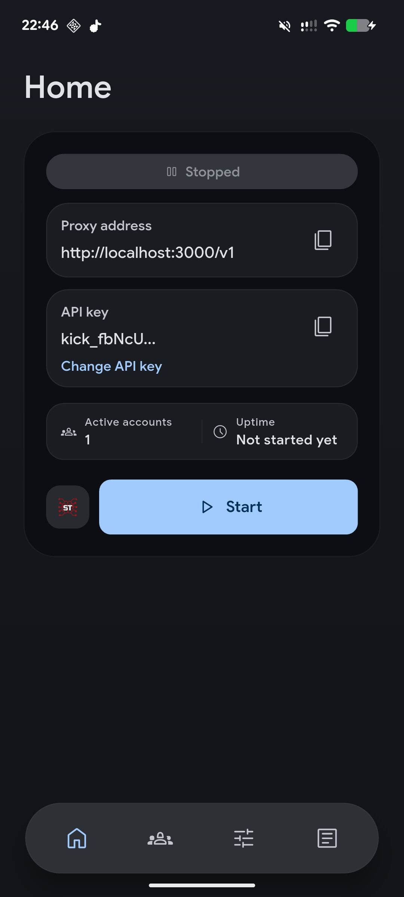
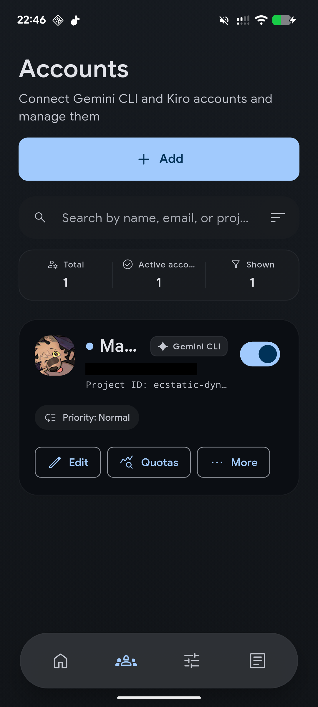
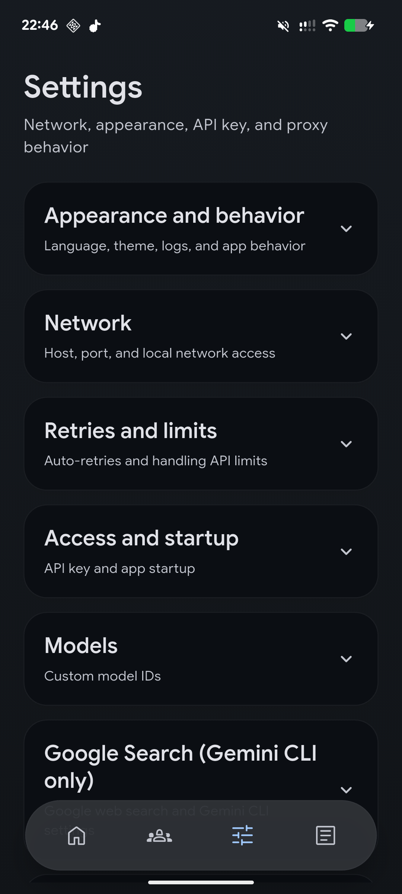
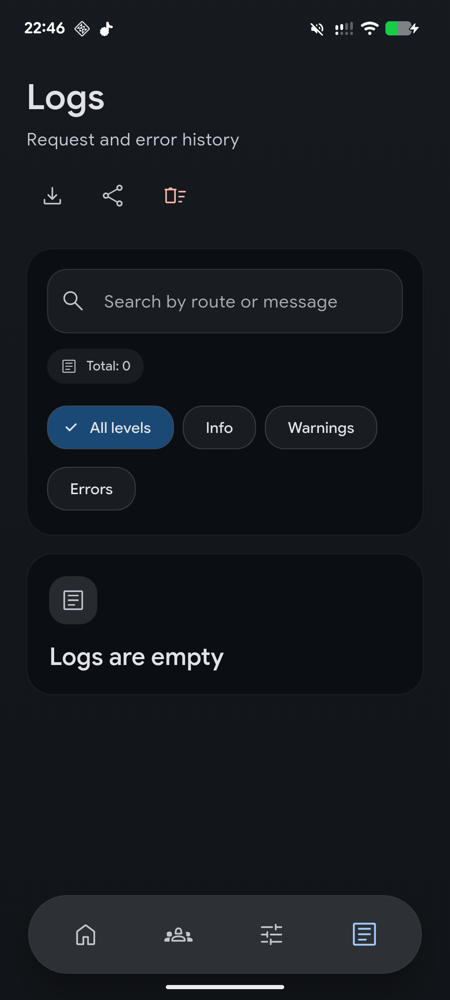

<div align="center">


<h1>KiCk</h1>

<p>
  <strong>A native local OpenAI-compatible proxy for Gemini CLI and Kiro.</strong>
</p>

<p>
  Connect your accounts, start a local <code>/v1</code> endpoint, and use Gemini CLI or Kiro from tools that already speak the OpenAI API.
</p>

<p>
  <a href="https://github.com/mxnix/kick/releases/latest">
    
  </a>
  <a href="https://github.com/mxnix/kick/actions/workflows/ci.yml">
    
  </a>
  <a href="https://github.com/mxnix/kick/releases">
    
  </a>
  <a href="https://flutter.dev/">
    
  </a>
  <a href="https://aur.archlinux.org/packages/kick-bin">
    
  </a>
  <a href="https://github.com/mxnix/kick/blob/main/LICENSE.md">
    
  </a>
</p>

<p>
  <a href="https://github.com/mxnix/kick/releases/latest"><strong>Download</strong></a> |
  <a href="#quickstart">Quickstart</a> |
  <a href="#screenshots">Screenshots</a> |
  <a href="docs/PRIVACY.md">Privacy</a> |
  <a href="docs/CONTRIBUTING.md">Contributing</a> |
  <a href="README_RU.md">Russian README</a>
</p>

</div>

---

## Screenshots

<p align="center">
  
  
  
  
</p>

## What KiCk Does

KiCk runs a local OpenAI-compatible server on your device and forwards requests to Gemini CLI through connected Google accounts, or to Kiro through an AWS Builder ID session. It is built for people who want a native app around local AI proxying: account management, keys, logs, retries, model routing, and one-button startup.

| Area | What you get |
| --- | --- |
| Local API | OpenAI-compatible `http://127.0.0.1:3000/v1` endpoint |
| Providers | Gemini CLI via Google sign-in, Kiro via AWS Builder ID |
| Platforms | Windows, Linux, and Android |
| Accounts | Multiple accounts with priority ordering and availability handling |
| Privacy | Tokens, settings, keys, and logs stay on your device |

## Quickstart

1. Download the latest build from [Releases](https://github.com/mxnix/kick/releases/latest), or install from a Linux repository below.
2. Open **Accounts** and connect a Gemini CLI or Kiro account.
3. For Gemini CLI, enter your `Google Cloud` project ID. For Kiro, finish AWS Builder ID authorization.
4. Return to **Home**, start the proxy, and copy the local endpoint plus API key.
5. Use them in Gemini CLI, SillyTavern, another OpenAI-compatible client, or your own app.

The default endpoint is `http://127.0.0.1:3000/v1`. You can change the host, port, LAN access, and API key behavior in settings.

## Features

- Local OpenAI-compatible proxy with `/v1/chat/completions` and `/v1/responses`.
- Account pool for Gemini CLI and Kiro with priorities, retries, cooldowns, and model filters.
- Native account connection flows for Google sign-in and AWS Builder ID.
- Configurable address, port, LAN access, access key, retry policy, and custom model IDs.
- One-click profile push to a running SillyTavern instance.
- Searchable logs with export, raw request logging controls, and sensitive data masking.
- Android background mode, desktop tray support, and launch-at-startup options.
- English and Russian interface, documentation, and release metadata.

## Supported Routes

- `GET /health`
- `GET /v1/models`
- `POST /v1/chat/completions`
- `POST /v1/responses`

## Request Example

```bash
curl http://127.0.0.1:3000/v1/chat/completions \
  -H "Content-Type: application/json" \
  -H "Authorization: Bearer YOUR_API_KEY" \
  -d '{
    "model": "gemini-2.5-pro",
    "messages": [
      {"role": "user", "content": "Write a short greeting"}
    ]
  }'
```

If API key protection is disabled, remove the `Authorization` header.

## Install

| Platform | Options |
| --- | --- |
| Windows | Download the installer from [Releases](https://github.com/mxnix/kick/releases/latest). |
| Linux | Use AppImage, `.deb`, `.rpm`, `.pkg.tar.zst`, `.tar.gz`, APT/RPM/Pacman repositories, or [AUR](https://aur.archlinux.org/packages/kick-bin). |
| Android | Download the APK from [Releases](https://github.com/mxnix/kick/releases/latest). |

<details>
<summary><strong>Linux repositories</strong></summary>

Debian, Ubuntu, and Linux Mint:

```bash
curl -fsSL https://mxnix.github.io/kick/linux/kick.asc | sudo gpg --dearmor -o /usr/share/keyrings/kick.gpg
echo "deb [signed-by=/usr/share/keyrings/kick.gpg] https://mxnix.github.io/kick/linux/apt stable main" | sudo tee /etc/apt/sources.list.d/kick.list
sudo apt update
sudo apt install kick
```

Fedora/RHEL/openSUSE-style systems:

```bash
sudo rpm --import https://mxnix.github.io/kick/linux/kick.asc
sudo tee /etc/yum.repos.d/kick.repo >/dev/null <<'EOF'
[kick]
name=KiCk
baseurl=https://mxnix.github.io/kick/linux/rpm/x86_64
enabled=1
gpgcheck=0
repo_gpgcheck=1
gpgkey=https://mxnix.github.io/kick/linux/kick.asc
EOF
sudo dnf install kick
```

Arch Linux-style systems:

```bash
curl -fsSL https://mxnix.github.io/kick/linux/kick.asc | sudo pacman-key --add -
sudo pacman-key --lsign-key "$(curl -fsSL https://mxnix.github.io/kick/linux/kick.asc | gpg --show-keys --with-colons | awk -F: '/^pub:/ { print $5; exit }')"
sudo tee -a /etc/pacman.conf >/dev/null <<'EOF'
[kick]
Server = https://mxnix.github.io/kick/linux/pacman/x86_64
SigLevel = DatabaseRequired PackageOptional
EOF
sudo pacman -Sy kick
```

Or install from the AUR:

```bash
yay -S kick-bin
```

```bash
paru -S kick-bin
```

On GNOME, tray support may require the AppIndicator extension.

</details>

## Privacy

- Sign-in tokens and the local access key are stored in the device's secure storage.
- Settings, account lists, and logs are stored locally.
- Full raw request logging is disabled by default.
- Sensitive values are masked when logs are saved or exported.
- Anonymous analytics is disabled by default.

Read the full [Privacy Policy](docs/PRIVACY.md).

## Troubleshooting

<details>
<summary><strong>Common fixes</strong></summary>

- Port already in use: choose a different port in settings.
- No active accounts: connect a Gemini CLI or Kiro account, or re-enable an existing one.
- Google sign-in expired: reconnect the Gemini CLI account.
- Kiro session expired: reconnect the Kiro account.
- Google asks for verification: open the verification page and sign in with the same account.
- Wrong `Google Cloud` project ID or disabled access: verify the project and its settings.
- `429` errors: wait for the limit to reset or enable temporary account cooldown.

</details>

## Build From Source

<details>
<summary><strong>Developer setup</strong></summary>

1. Install Flutter and the required Android, Windows, or Linux tooling for your target platform.
2. Install dependencies and run tests:

```powershell
flutter pub get
flutter test
```

3. Run the app:

```powershell
flutter run -d windows
```

```bash
flutter run -d linux
```

```powershell
flutter run -d android
```

4. Build the Windows installer locally with Inno Setup 6:

```powershell
powershell -NoProfile -ExecutionPolicy Bypass -File .\scripts\build-windows-installer.ps1
```

5. Build Linux packages locally with `nfpm` and `appimagetool`:

```bash
scripts/build-linux-packages.sh
```

Build and release details live in [CONTRIBUTING.md](docs/CONTRIBUTING.md). Localization notes live in [LOCALIZATION.md](docs/LOCALIZATION.md).

</details>
