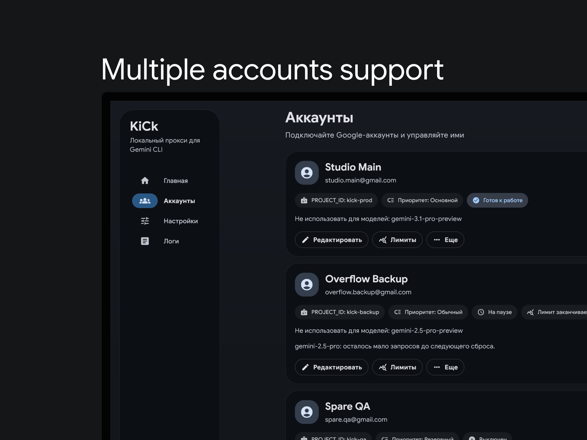
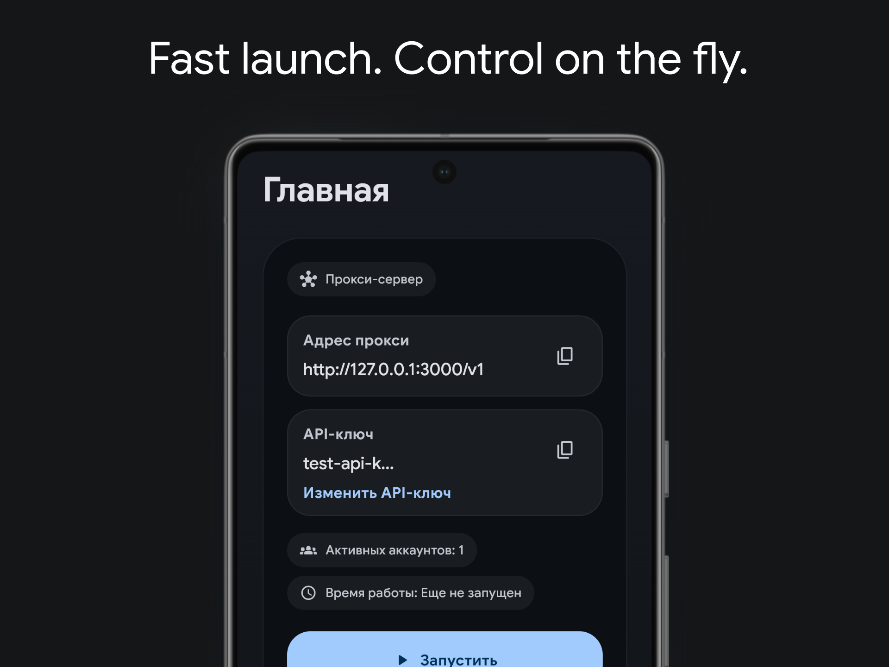

<div align="center">


# KiCk

<p align="center">
  <a href="https://github.com/mxnix/kick/releases/latest">
    
  </a>
  <a href="https://github.com/mxnix/kick/actions">
    
  </a>
  <a href="https://flutter.dev/">
    
  </a>
  <a href="https://github.com/mxnix/kick/blob/main/LICENSE.md">
    
  </a>
  <a href="https://weblate.nikz.lol/projects/kick/">
    
  </a>
</p>

**A local OpenAI-compatible proxy for Gemini CLI and Kiro in a native Flutter app**

README на русском: [README_RU.md](README_RU.md)

**Supported platforms**

<a href="https://github.com/mxnix/kick/releases/latest">
  
</a>
<a href="https://github.com/mxnix/kick/releases/latest">
  
</a>
<a href="https://github.com/mxnix/kick/releases/latest">
  
</a>

</div>

<details>
<summary><strong>Interface</strong></summary>

<p align="center">
  
</p>

<p align="center">
  
</p>

</details>

<details>
<summary><strong>What It Is</strong></summary>

KiCk starts a local OpenAI-compatible endpoint on your device and forwards requests to Gemini CLI through connected Google accounts, or to Kiro through an AWS Builder ID session. It is built for people who want to use Gemini CLI or Kiro without the terminal, manual sign-in setup, or a separate local server.

</details>

<details>
<summary><strong>What It Does</strong></summary>

- Runs a local endpoint at `http://127.0.0.1:3000/v1` by default.
- Accepts OpenAI-format requests.
- Works with multiple Gemini CLI and Kiro accounts, supports priority ordering, and can temporarily remove a problematic account from rotation.
- Connects Gemini CLI through Google sign-in in the browser and Kiro through AWS Builder ID.
- Lets you change the address, port, access key, retry count, and model list.
- Shows proxy status, account status, and logs.
- Can run in the background on Android.
- Can start at sign-in and minimize to tray on desktop.

</details>

<details>
<summary><strong>Get Started</strong></summary>

1. Download the latest version from the [releases page](https://github.com/mxnix/kick/releases/latest), or install the Linux package repository below.
2. Open the accounts screen and connect a Gemini CLI or Kiro account.
3. If you choose Gemini CLI, enter your `Google Cloud` project ID. For Kiro, just complete AWS Builder ID authorization.
4. Return to the main screen and start the proxy.
5. Copy the local endpoint and access key, if required.
6. Use them in your app, Gemini CLI, or any other OpenAI-compatible client.

The default endpoint is `http://127.0.0.1:3000/v1`. You can change it in settings.

</details>

<details>
<summary><strong>Supported Endpoints</strong></summary>

- `GET /health`
- `GET /v1/models`
- `POST /v1/chat/completions`
- `POST /v1/responses`

</details>

<details>
<summary><strong>Request Example</strong></summary>

```bash
curl http://127.0.0.1:3000/v1/chat/completions \
  -H "Content-Type: application/json" \
  -H "Authorization: Bearer YOUR_API_KEY" \
  -d '{
    "model": "gemini-2.5-pro",
    "messages": [
      {"role": "user", "content": "Write a short greeting"}
    ]
  }'
```

If you disabled the access key requirement, you can remove the `Authorization` header.

</details>

<details>
<summary><strong>What You Can Configure</strong></summary>

- Network settings: address, port, and LAN access.
- Access control: API key requirement, viewing the current key, and rotating it.
- Reliability: retry count, delay after `429`, and temporary account cooldowns.
- Models: additional model list and blocked models for a specific account.
- Google: default web search and whether sources are shown in responses.
- App settings: theme, log verbosity, Android background mode, and desktop auto-start.

</details>

<details>
<summary><strong>Install on Linux</strong></summary>

Debian, Ubuntu, and Linux Mint:

```bash
curl -fsSL https://mxnix.github.io/kick/linux/kick.asc | sudo gpg --dearmor -o /usr/share/keyrings/kick.gpg
echo "deb [signed-by=/usr/share/keyrings/kick.gpg] https://mxnix.github.io/kick/linux/apt stable main" | sudo tee /etc/apt/sources.list.d/kick.list
sudo apt update
sudo apt install kick
```

Fedora/RHEL/openSUSE-style systems:

```bash
sudo rpm --import https://mxnix.github.io/kick/linux/kick.asc
sudo tee /etc/yum.repos.d/kick.repo >/dev/null <<'EOF'
[kick]
name=KiCk
baseurl=https://mxnix.github.io/kick/linux/rpm/x86_64
enabled=1
gpgcheck=0
repo_gpgcheck=1
gpgkey=https://mxnix.github.io/kick/linux/kick.asc
EOF
sudo dnf install kick
```

Arch Linux-style systems:

```bash
curl -fsSL https://mxnix.github.io/kick/linux/kick.asc | sudo pacman-key --add -
sudo pacman-key --lsign-key "$(curl -fsSL https://mxnix.github.io/kick/linux/kick.asc | gpg --show-keys --with-colons | awk -F: '/^pub:/ { print $5; exit }')"
sudo tee -a /etc/pacman.conf >/dev/null <<'EOF'
[kick]
Server = https://mxnix.github.io/kick/linux/pacman/x86_64
SigLevel = DatabaseRequired PackageOptional
EOF
sudo pacman -Sy kick
```

You can also download the Linux AppImage, `.deb`, `.rpm`, `.pkg.tar.zst`, or `.tar.gz` files from the release page. On GNOME, tray support may require the AppIndicator extension.

</details>

<details>
<summary><strong>Where Data Is Stored</strong></summary>

- Sign-in tokens and the local access key are stored in the device's secure storage.
- Settings, account lists, and logs are stored locally.
- Full raw request logging is disabled by default.
- Sensitive data is masked when logs are saved or exported.
- Anonymous analytics is disabled by default.

Details: [Privacy Policy](docs/PRIVACY.md).

</details>

<details>
<summary><strong>If Something Does Not Work</strong></summary>

- The port is already in use: choose a different port in settings.
- No active accounts: connect a Gemini CLI or Kiro account, or re-enable an existing one.
- Google sign-in expired: reconnect the Gemini CLI account.
- Kiro session expired: reconnect the Kiro account.
- Google asks you to verify the account: open the verification page and sign in with the same account.
- The `Google Cloud` project ID is wrong or the required access is disabled: verify the project and its settings.
- `429` error: wait for the limit to reset or enable temporary account cooldown.

</details>

<details>
<summary><strong>Build From Source</strong></summary>

1. Install Flutter and the required Android/Linux tooling for the target you want to build.
2. Run:

```powershell
flutter pub get
flutter test
```

3. To run during development, use:

```powershell
flutter run -d windows
```

or

```bash
flutter run -d linux
```

or

```powershell
flutter run -d android
```

4. To build the Windows installer locally, install Inno Setup 6:

```powershell
powershell -NoProfile -ExecutionPolicy Bypass -File .\scripts\build-windows-installer.ps1
```

5. To build Linux packages locally, install `nfpm` and `appimagetool`, then run:

```bash
scripts/build-linux-packages.sh
```

Build and release details: [CONTRIBUTING.md](docs/CONTRIBUTING.md).

</details>

[License](LICENSE.md) | [Privacy Policy](docs/PRIVACY.md) | [Localization](docs/localization.md) | [Contributing](docs/CONTRIBUTING.md)
