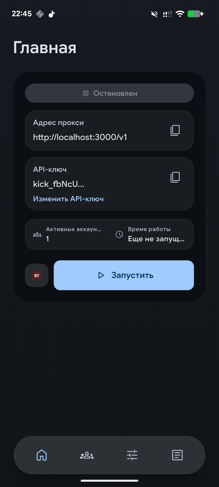

<div align="center">


<h1>KiCk</h1>

<p>
  <strong>Нативный локальный OpenAI-совместимый прокси для Gemini CLI и Kiro.</strong>
</p>

<p>
  Подключайте аккаунты, запускайте локальный <code>/v1</code> адрес и используйте Gemini CLI или Kiro из инструментов, которые уже умеют работать с OpenAI API.
</p>

<p>
  <a href="https://github.com/mxnix/kick/releases/latest">
    
  </a>
  <a href="https://github.com/mxnix/kick/actions/workflows/ci.yml">
    
  </a>
  <a href="https://github.com/mxnix/kick/releases">
    
  </a>
  <a href="https://flutter.dev/">
    
  </a>
  <a href="https://aur.archlinux.org/packages/kick-bin">
    
  </a>
  <a href="https://github.com/mxnix/kick/blob/main/LICENSE.md">
    
  </a>
</p>

<p>
  <a href="https://github.com/mxnix/kick/releases/latest"><strong>Скачать</strong></a> ·
  <a href="#быстрый-старт">Быстрый старт</a> ·
  <a href="#скриншоты">Скриншоты</a> ·
  <a href="docs/PRIVACY.md">Приватность</a> ·
  <a href="docs/CONTRIBUTING.md">Как вносить изменения</a> ·
  <a href="README.md">English README</a>
</p>

</div>

---

## Скриншоты

<p align="center">
  
  
  
  
</p>

## Что делает KiCk

KiCk поднимает на вашем устройстве локальный OpenAI-совместимый сервер и пересылает запросы в Gemini CLI через подключенные Google-аккаунты, а в Kiro через выполненный вход в Kiro. Это нативная оболочка для локального AI-прокси: аккаунты, ключи, журнал, повторы, маршрутизация моделей и запуск одной кнопкой.

| Область | Что есть |
| --- | --- |
| Локальный API | OpenAI-совместимый адрес `http://127.0.0.1:3000/v1` |
| Провайдеры | Gemini CLI через вход Google, Kiro через вход GitHub или Google |
| Платформы | Windows, Linux и Android |
| Аккаунты | Несколько аккаунтов с приоритетами и обработкой доступности |
| Приватность | Токены, настройки, ключи и журнал остаются на устройстве |

## Быстрый старт

1. Скачайте последнюю сборку из [Releases](https://github.com/mxnix/kick/releases/latest) или подключите Linux-репозиторий ниже.
2. Откройте **Аккаунты** и подключите аккаунт Gemini CLI или Kiro.
3. Для Gemini CLI укажите идентификатор проекта в `Google Cloud`. Для Kiro выполните вход через GitHub или Google в браузере.
4. Вернитесь на **Главную**, запустите прокси и скопируйте локальный адрес вместе с API-ключом.
5. Используйте их в Gemini CLI, SillyTavern, другом OpenAI-совместимом клиенте или своем приложении.

По умолчанию используется адрес `http://127.0.0.1:3000/v1`. Хост, порт, доступ из локальной сети и поведение API-ключа меняются в настройках.

## Возможности

- Локальный OpenAI-совместимый прокси с `/v1/chat/completions` и `/v1/responses`, в том числе SSE-стриминг при `"stream": true`.
- Пул аккаунтов Gemini CLI и Kiro с приоритетами, повторами, временными паузами и фильтрами моделей.
- Нативные сценарии подключения через вход Google и вход в Kiro через GitHub или Google.
- Настройка адреса, порта, доступа из локальной сети, ключа доступа, повторов и собственных ID моделей.
- Отправка профиля в запущенный SillyTavern в один клик.
- Поиск по журналу, экспорт, контроль записи сырых запросов и маскирование чувствительных данных.
- Фоновый режим Android, поддержка трея на настольных системах и автозапуск.
- Английский и русский интерфейс, документация и метаданные релизов.

## Поддерживаемые адреса

- `GET /health`
- `GET /v1/models`
- `POST /v1/chat/completions`
- `POST /v1/responses`

## Пример запроса

```bash
curl http://127.0.0.1:3000/v1/chat/completions \
  -H "Content-Type: application/json" \
  -H "Authorization: Bearer ВАШ_КЛЮЧ" \
  -d '{
    "model": "gemini-3.1-pro-preview",
    "messages": [
      {"role": "user", "content": "Напиши короткое приветствие"}
    ]
  }'
```

Если проверка ключа отключена, уберите строку с `Authorization`.

## Установка

| Платформа | Варианты |
| --- | --- |
| Windows | Установщик в [Releases](https://github.com/mxnix/kick/releases/latest). |
| Linux | AppImage, `.deb`, `.rpm`, `.pkg.tar.zst`, `.tar.gz`, APT/RPM/Pacman-репозитории или [AUR](https://aur.archlinux.org/packages/kick-bin). |
| Android | APK в [Releases](https://github.com/mxnix/kick/releases/latest) или [Obtainium](http://apps.obtainium.imranr.dev/redirect.html?r=obtainium://add/https://github.com/mxnix/kick). |

<details>
<summary><strong>Linux-репозитории</strong></summary>

Debian, Ubuntu и Linux Mint:

```bash
curl -fsSL https://mxnix.github.io/kick/linux/kick.asc | sudo gpg --dearmor -o /usr/share/keyrings/kick.gpg
echo "deb [signed-by=/usr/share/keyrings/kick.gpg] https://mxnix.github.io/kick/linux/apt stable main" | sudo tee /etc/apt/sources.list.d/kick.list
sudo apt update
sudo apt install kick
```

Fedora/RHEL/openSUSE-подобные системы:

```bash
sudo rpm --import https://mxnix.github.io/kick/linux/kick.asc
sudo tee /etc/yum.repos.d/kick.repo >/dev/null <<'EOF'
[kick]
name=KiCk
baseurl=https://mxnix.github.io/kick/linux/rpm/x86_64
enabled=1
gpgcheck=0
repo_gpgcheck=1
gpgkey=https://mxnix.github.io/kick/linux/kick.asc
EOF
sudo dnf install kick
```

Arch Linux-подобные системы:

```bash
curl -fsSL https://mxnix.github.io/kick/linux/kick.asc | sudo pacman-key --add -
sudo pacman-key --lsign-key "$(curl -fsSL https://mxnix.github.io/kick/linux/kick.asc | gpg --show-keys --with-colons | awk -F: '/^pub:/ { print $5; exit }')"
sudo tee -a /etc/pacman.conf >/dev/null <<'EOF'
[kick]
Server = https://mxnix.github.io/kick/linux/pacman/x86_64
SigLevel = DatabaseRequired PackageOptional
EOF
sudo pacman -Sy kick
```

Или установите из AUR:

```bash
yay -S kick-bin
```

```bash
paru -S kick-bin
```

В GNOME для трея может понадобиться расширение AppIndicator.

</details>

## Приватность

- Токены входа и локальный ключ доступа хранятся в защищенном хранилище устройства.
- Настройки, список аккаунтов и журнал работы хранятся локально.
- Запись полных сырых запросов по умолчанию отключена.
- При сохранении и выгрузке журнала чувствительные значения маскируются.
- Анонимная аналитика отключена по умолчанию.

Полная версия: [Политика конфиденциальности](docs/PRIVACY.md).

## Если что-то не работает

<details>
<summary><strong>Частые решения</strong></summary>

- Порт занят: выберите другой порт в настройках.
- Нет активных аккаунтов: подключите аккаунт Gemini CLI или Kiro либо включите уже добавленный.
- Истек вход в Google: переподключите аккаунт Gemini CLI.
- Истекла сессия Kiro: войдите в Kiro заново.
- Google просит подтвердить аккаунт: откройте страницу подтверждения и войдите тем же аккаунтом.
- Неверный `Google Cloud` project ID или отключен нужный доступ: проверьте проект и его настройки.
- Ошибка `429`: подождите сброса ограничения или включите временный cooldown аккаунта.

</details>

## Сборка из исходников

<details>
<summary><strong>Настройка разработки</strong></summary>

1. Установите Flutter и нужные инструменты для целевой платформы: Android, Windows или Linux.
2. Установите зависимости и запустите тесты:

```powershell
flutter pub get
flutter test
```

3. Запустите приложение:

```powershell
flutter run -d windows
```

```bash
flutter run -d linux
```

```powershell
flutter run -d android
```

4. Для локальной сборки Windows-установщика нужен Inno Setup 6:

```powershell
powershell -NoProfile -ExecutionPolicy Bypass -File .\scripts\build-windows-installer.ps1
```

5. Для локальной сборки Linux-пакетов установите `nfpm` и `appimagetool`:

```bash
scripts/build-linux-packages.sh
```

Подробности по сборке и выпуску: [CONTRIBUTING.md](docs/CONTRIBUTING.md). Заметки по локализации: [LOCALIZATION.md](docs/LOCALIZATION.md).

</details>
